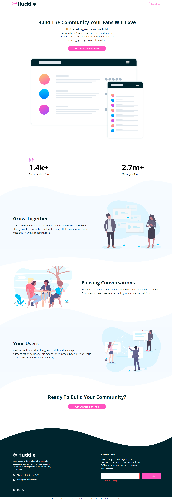

# Frontend Mentor - Huddle Landing Page With Curved Sections

This is a solution to the [Huddle Landing Page With Curved Sections on Frontend Mentor](https://www.frontendmentor.io/solutions/huddle-landing-page-with-curved-sections-responsive-design-nR4ew2kicB). Frontend Mentor challenges help you improve your coding skills by building realistic projects. 

## Table of contents

- [Overview](#overview)
  - [The challenge](#the-challenge)
  - [Screenshot](#screenshot)
  - [Links](#links)
- [My process](#my-process)
  - [Built with](#built-with)
  - [Continued development](#continued-development)
  - [Useful resources](#useful-resources)
- [Author](#author)

## Overview

### The challenge

Users should be able to:

- View the optimal layout for the site depending on their device's screen size
- See hover states for all interactive elements on the page

### Screenshot

### Links

- Solution URL: [Solution](https://www.frontendmentor.io/solutions/huddle-landing-page-with-curved-sections-responsive-design-nR4ew2kicB)
- Live Site URL: [Live Site](https://mauriciompf.github.io/Huddle-Landing-Page-With-Curved-Sections/)

## My process

### Built with

- Semantic HTML5 markup
- CSS custom properties
- Flexbox
- CSS Grid
- Mobile-first workflow

### Continued development

- Accessibility
- CSS Grid
- Validation
- CSS custom properties

### Useful resources

- [Utopia](https://utopia.fyi/) - I was able to create custom fonts with responsive features thanks to this.

## Author

- Website - [Mauricio F.](https://github.com/mauriciompf)
- Frontend Mentor - [@Mpfarias-ken](https://www.frontendmentor.io/profile/Mpfarias-ken)